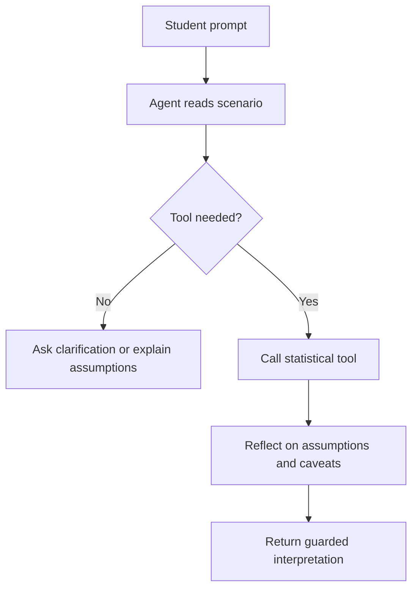
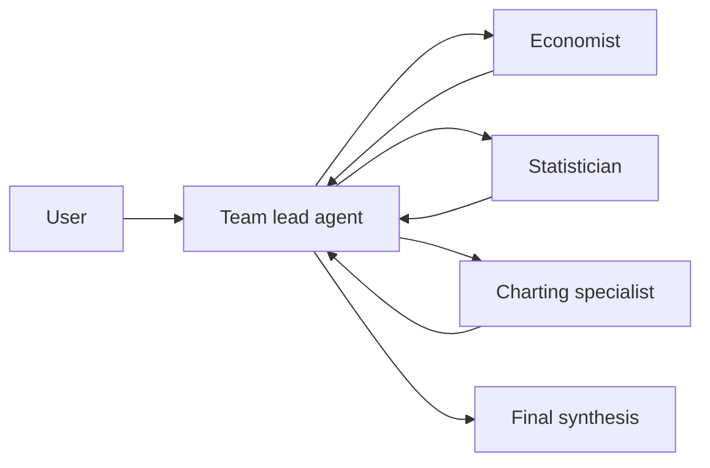
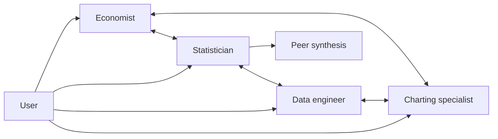

# Agent Curriculum

This curriculum uses Microsoft Agent Framework concepts to teach agent design in a statistical-analysis setting.

Official references used when writing the notebooks:

- Microsoft Agent Framework overview: https://learn.microsoft.com/en-us/agent-framework/overview/
- function tools: https://learn.microsoft.com/en-us/agent-framework/agents/tools/function-tools
- tools overview: https://learn.microsoft.com/en-us/agent-framework/agents/tools/
- OpenAI providers: https://learn.microsoft.com/en-us/agent-framework/agents/providers/openai
- GroupChatBuilder: https://learn.microsoft.com/en-us/python/api/agent-framework-core/agent_framework.groupchatbuilder

## Lesson Sequence

1. Single t-test tool agent
2. Multiple statistical tools and tool selection
3. Reflection loop for statistical reasoning
4. Code generation, execution, bug learning, and retry
5. Hierarchical group chat with team lead, statistician, and charting specialist
6. Peer group with no hierarchy
7. Economist/statistician research team for event/economic hypotheses

## Agent Pattern Map



## Group Chat Patterns





## Teaching Principles

- Prefer deterministic functions when a function can solve the task.
- Use agents for open-ended reasoning, interpretation, and tool selection.
- Keep statistical tools small and auditable.
- Reflect on assumptions before interpreting p-values.
- Make every agent state whether it is reporting association or causation.
- Treat generated code as untrusted until executed and tested.

## Microsoft Agent Framework Notes

Microsoft Agent Framework supports function tools by passing Python callables to an agent's `tools` parameter. The docs also show an optional `@tool` decorator for naming and describing tools.

Agent Framework distinguishes agents from workflows:

- agents are useful for open-ended or conversational tasks
- workflows are useful when the execution path should be explicit

For this curriculum, notebooks start with deterministic functions and then show optional live-agent wiring. This keeps the lessons usable in classrooms without credentials while still demonstrating how to move toward live agents.

## Reusable Prompt

```text
You are a cautious statistical agent. Given the user's scenario, first identify the unit of analysis, treatment, outcome, comparison group, and whether observations are independent or paired. Choose only among Welch t-test, Student t-test, Mann-Whitney U, ANOVA, Kruskal-Wallis, paired t-test, Wilcoxon signed-rank, or controlled OLS. Before interpreting, state assumptions, sample-size or power concerns, and whether the result supports association only.
```
