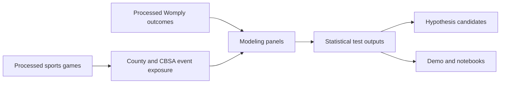

# Data Cards

Start here before using the notebooks.

Recommended reading order:

1. `events_data_card.md`
2. `economic_data_card.md`
3. `modeling_statistics_data_card.md`

The data is curated for teaching. It is suitable for lessons on data joins, semantic modeling, statistical testing, and agent design. It should not be used to make causal claims without a new research design.

## Lineage

