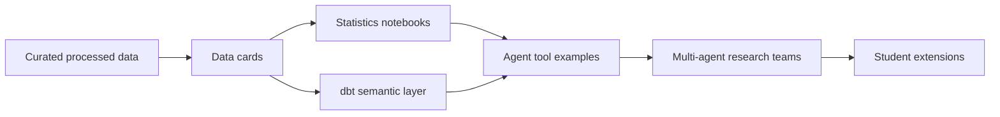

# Multiphase Teaching Project Plan

## Goal

Bootstrap a student-facing project where learners can use prompts with coding agents to rebuild pieces of an event/economic analysis pipeline and extend it with statistical testing, semantic modeling, and agentic workflows.

## Project Flow



## Phase 0 - Curated Data Foundation

Status: complete.

Deliverables:

- copy curated processed event and economic data into `data/processed/`
- preserve both legacy city-level files and newer U.S. county/CBSA files
- include statistical outputs produced by the source project
- write data cards for dataset families

Student outcome:

Students can inspect real processed project data without needing raw sports or Economic Tracker downloads.

Prompt checkpoint:

```text
Act as a careful data engineer. Inspect the data cards and the processed CSV files. Summarize the grain, key columns, and caveats for the event, economic, and statistical output datasets. Do not write code until you identify the unit of analysis.
```

## Phase 1 - Statistical Testing Teaching Notebooks

Status: complete.

Deliverables:

- notebook on Welch t-test, Student t-test, and Mann-Whitney U
- notebook on ANOVA and Kruskal-Wallis
- notebook on paired t-test and Wilcoxon signed-rank event windows
- notebook on controlled OLS, multiple testing, and statistical power

Student outcome:

Students can map each test to a research question, identify assumptions, run small examples, and interpret p-values, effect sizes, and caveats.

Prompt checkpoint:

```text
Act as a statistician. Given a research question, treatment, outcome, and geography level, choose one of the tests used in this project. Explain the null hypothesis, assumptions, required columns, power concerns, and interpretation caveats before writing code.
```

## Phase 2 - dbt Semantic Layer Notebooks

Status: complete.

Deliverables:

- notebook introducing semantic-layer concepts
- notebook walking through dbt sources and staging models
- notebook covering marts, metrics, and dbt tests
- starter dbt project in `dbt/event_eco_semantic/`

Student outcome:

Students can understand how curated CSV files become reusable analytical models.

Prompt checkpoint:

```text
Act as an analytics engineer. Build a dbt staging model and mart from the curated event/economic CSVs. Explain the grain, source fields, tests, and how the mart supports statistical analysis.
```

## Phase 3 - Agent Foundations

Status: complete.

Deliverables:

- single-tool t-test agent notebook
- multi-tool statistical test selection notebook
- reflection loop notebook
- statistical code generation/debug/refinement notebook

Student outcome:

Students can reason about when an agent should call tools, how to validate the result, and how reflection can improve statistical reasoning.

Prompt checkpoint:

```text
Act as an agent designer. Create a small statistical tool, define when the agent should call it, run an example, and add a reflection step that checks assumptions and prevents causal overclaiming.
```

## Phase 4 - Multi-Agent Research Teams

Status: complete.

Deliverables:

- hierarchical group-chat notebook
- no-hierarchy peer group notebook
- economist/statistician/charting team experimental-design notebook

Student outcome:

Students can compare manager-led and peer-style agent collaboration patterns in the event/economic analysis context.

Prompt checkpoint:

```text
Act as a multi-agent system architect. Design a team with an economist, statistician, data engineer, and visualization specialist. Give each role a responsibility, a handoff rule, and a final synthesis rule.
```

## Phase 5 - Student Extension Track

Status: planned.

Recommended extensions:

- add a new sport, league, or event type
- build additional dbt marts for event intensity and playoff exposure
- add a notebook for difference-in-differences or event-study design
- build a small Streamlit or static HTML demo
- write grading rubrics for prompt quality, statistical interpretation, and code validation

## Execution Rules For Students

1. Start from the data cards before writing code.
2. Write the research question before choosing a test.
3. Check assumptions before interpreting p-values.
4. Prefer deterministic tools before live LLM calls.
5. Treat agent outputs as drafts that need validation.
6. Use association language unless a causal design is explicitly justified.
